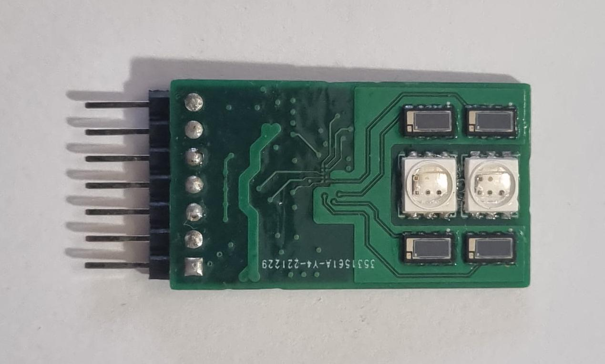

# Flapometer – Data Acquisition Software
*(See below for step by step build and deployment instructions)*

## Overview

This repository contains the complete C++ data acquisition software developed for the **Flapometer**, a prototype spectrophotometric medical device designed for continuous monitoring of tissue perfusion. 

## Author

The software was developed and implemented by me from the ground up, along with the hardware and data analysis software, as part of my M.D. thesis at the University of Medicine and Pharmacy "Carol Davila", Bucharest.

## Hardware

The software is developed to run on Raspberry Pi and was developed and tested on a Raspberry Pi 3 Model B+. The custom data acquisition hardware is built around MAX86171 Analog Front End chips, purpose-built LED arrays and VEMD8080 PIN photodiodes. Hardware design files (schematics, PCB layout or other CAD files) are not included in this repository.



## Data analysis

This repository only contains the C++ data acquisition software. The entire data analysis pipeline, including signal processing, spectrophotometric analysis and proposed ischemia detection algorithms are implemented in Python. A demo notebook of the algorithm can be found here: https://github.com/andan42/flapometer-data-analysis

## Features

- Real-time acquisition of spectrophotometric sensor data
- I²C implementation for MAX86171 Analog Front End data acquisition
- Multi-I²C sensor architecture
- Modular C++ codebase
- Integration with a local REST API

## Repository Contents

```
src/    Source code (source and header files)
documentation/    Useful references for MAX86171 Analog Front End
test/    Unit tests
```

## Disclaimer

This repository contains research software developed for a proof-of-concept prototype medical device.

No patient-identifiable data or confidential clinical data are included.

This software is intended for research and educational purposes only and is **not** intended for clinical use... yet

---

## Raspberry Pi setup instructions for compiling project

### Enable I2C interface:
```bash
sudo raspi-config
```
### Add lines in `/boot/config.txt`  :
```bash
#A
dtoverlay=i2c-gpio,bus=6,i2c_gpio_sda=20,i2c_gpio_scl=21
#B
dtoverlay=i2c-gpio,bus=5,i2c_gpio_sda=7,i2c_gpio_scl=1
#C
dtoverlay=i2c-gpio,bus=4,i2c_gpio_sda=0,i2c_gpio_scl=5
#D
dtoverlay=i2c-gpio,bus=3,i2c_gpio_sda=19,i2c_gpio_scl=26
```
```bash
sudo reboot now
```
### Use I2C tools to debug hardware connections:
```bash
sudo apt-get install i2c-tools
```
```bash
i2cdetect -y 1
i2cdetect -y 5
i2cdetect -y 6
```
(should return 48, 64, 65)
### Install libraries:
```bash
sudo apt-get install clang
sudo apt-get install libcurl4-openssl-dev
sudo apt-get install libjsoncpp-dev
sudo apt-get install libi2c-dev
```
## Instructions for compiling tests
```
sudo apt-get install cmake
sudo apt-get install libgtest-dev
cd /usr/src/gtest
sudo cmake -Bbuild
sudo cmake --build build
sudo cp ./build/lib/libgtest* /usr/lib
sudo cp ./build/lib/libgtest_main* /usr/lib
cd ~
```

# How to Enable/Disable Pi Health Monitor Service
This section explains usage of `pi_health_monitor.sh` and `pi_health_monitor.service` to ensure the Raspberry Pi restarts every 60 minutes and runs our project on startup. The following commands allow enabling and disabling this.

## Initial Setup (After Cloning)
If you are setting up the service for the first time on a new device, follow these steps:

1. **Navigate to the project directory:**
    ```sh
    cd /home/pi/Projects/FlapometerCpp/
    ```

2. **Copy the service file to the systemd directory:**
    ```sh
    sudo ln -s /home/pi/Projects/FlapometerCpp/pi_health_monitor.service /etc/systemd/system/pi_health_monitor.service
    ```

3. **Reload systemd to recognize the service:**
    ```sh
    sudo systemctl daemon-reload
    ```

4. **Enable and start the service:**
    ```sh
    sudo systemctl enable pi_health_monitor.service
    sudo systemctl start pi_health_monitor.service
    ```

Now the service will run on startup and restart the Raspberry Pi every 60 minutes.

---

## Disable the service (Prevent it from running)
Run:
    sudo systemctl stop pi_health_monitor.service
    sudo systemctl disable pi_health_monitor.service

## Enable the service (Start it again)
Run:
    sudo systemctl enable pi_health_monitor.service
    sudo systemctl start pi_health_monitor.service

## Check service status
Run:
    systemctl status pi_health_monitor.service

---

## Troubleshooting
- If the service does not appear in `systemctl list-unit-files`, make sure the `.service` file is in the correct location and run:
    ```sh
    sudo systemctl daemon-reload
    ```
- If you cloned the project into a different folder, update the `ExecStart` path in `pi_health_monitor.service` to match your new directory.

